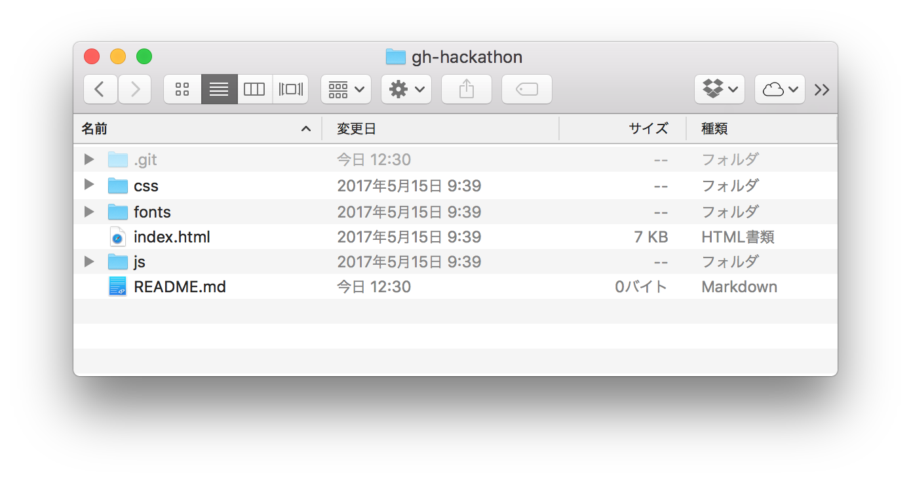

# 日報アプリを作る（その2）「ベースになるコードの説明」

前回に続いて日報アプリを作っていきます。今回からhifiveを使っていきます。まず今回はベースのコードについて説明します。

## 下準備

まず[ベースになるZipファイルをダウンロード](https://github.com/hifivemania/hifive-github-handson/blob/master/4.zip?raw=true)してください。2回目が終わった時に比べて、次の変更を行っています。

- Bootstrapの導入
- Bootstrapに合わせてHTMLの修正
- hifiveの導入
- 作成するJavaScriptのスケルトン追加

Bootstrapを使うことで、レスポンシブ（デスクトップやスマートフォンなど画面幅の違うデバイスに合わせて表示をダイナミックに変化させる仕組み）対応が簡単になります。詳しくは、[HTML5で業務システムを構築しよう - 第10回　HTML5で日報アプリを作る　実装編［2］　画面のレイアウトを定義する：ITpro](http://itpro.nikkeibp.co.jp/atcl/column/14/121100125/112700011/?ST=oss)をご覧ください。

ダウンロード&解凍したら、すべてのファイルを最初に作成したディレクトリ/フォルダに移動してください（上書きするものはないはずです）。gh-hackathonフォルダの内容が次のようになっていればOKです。



終わったら Gitコマンドでaddオプションを使います。最後に「.」を打っているのはカレントディレクトリ以下、すべてのファイルが対象だということです。

```
$ git add .
```

追加したらコミットします。メッセージは適当につけてください。

```
$ git commit -m "Add basement"
```

そしてpushコマンドでGitリポジトリに反映します。

```
$ git push origin master
```

ここでいう origin というのはリモートの名前です。確認するには次のようにコマンドを打ちます。

```
$ git remote -v
origin	git@github.com:moongift/gh-hackathon.git (fetch)
origin	git@github.com:moongift/gh-hackathon.git (push)
```

masterというのはローカルリポジトリのブランチ名です。現在のブランチ名を確認するには次のようにします。

```
$ git branch
* master
```

つまり `git push origin master` というのは master ブランチの内容を origin へ反映するという意味になります。

----

# ここから先はコードを書きません。説明のみです。内容を確認したら次に進んでください。

----

では、ファイル内容について説明します。

## JavaScriptファイルについて

jsフォルダの下に util.js/index.js を追加しています。それぞれ、

- util.js : ユーティリティ系。よく使うメソッドを定義
- index.js : コントローラやロジックを実装

となっています。util.jsには formatDateWithHyphen というメソッドが定義されています。これは渡された日付オブジェクトを YYYY-MM-DDの形式で返すものです。

後、下には次のような記述があります。

```
// ダミー用のajax（サーバを使用しないため、）
h5.ajax = function() {
   var dfd = h5.async.deferred();
   setTimeout(function(){
       dfd.resolve({});
   }, 500);
   return dfd.promise();
};
```

今回はサーバを用意していませんので、実行するとエラーになってしまいます。そこで、上記のような処理でラッピングすることでエラーを出さないようにしています。通常の業務システム開発などでは使わないテクニックですが、何かで役に立つかも知れません。

## スコープを知る

util.jsの基本形は次のようになっています。

```
(function ($) {
  // 何かの処理
})(jQuery);
```

このように関数で囲むことで変数のスコープをその範囲に閉じ込められます。変数名のバッティングやグローバル環境の汚染を防ぐのに使えます。逆に、もし変数を別なファイルでも使いたいと言った場合には、

```
h5.u.obj.expose(変数名, 変数の内容);
```

というメソッドで定義できるようになります。util.jsの上の方で、

```
h5.u.obj.expose('handson.utils', {
  // 変数の内容
});
```

としているのが分かるかと思います。これによって、別なファイルからは `handosn.utils` という変数でアクセスできるようになります。今回の `formatDateWithHyphen` については、 `handson.utils.formatDateWithHyphen` でアクセスできます。

## index.jsの基本構造について

続いて index.js についてです。最初は次のようになっています。

```
(function($) {
	var reportController = {
		__name: 'handson.ReportController',

		__ready: function() {
		},
		
		'input, textarea focusout': function(context, $el) {
		},

		'input[name="img"] change': function(context, $el) {
		},

		'.register click': function(context, $el) {
		},
		
		'.confirm click': function(context, $el) {
		},

	};
	
	h5.core.expose(reportController);
})(jQuery);

$(function() {
	h5.core.controller(document.body, handson.ReportController);
});
```
大きく分けて2つに分かれています。下の
 
```
$(function() {

});
```

はjQueryのDOM構築完了時に呼ばれるメソッドで、 `handson.ReportController` を document.body 以下にバインドしています（handson.ReportController）については後述します。

### handson.ReportController について

handson.ReportController については次のようになっています。

```
var reportController = {
	__name: 'handson.ReportController',

	__ready: function() {
	},
	
	'input, textarea focusout': function(context, $el) {
	},

	'input[name="img"] change': function(context, $el) {
	},

	'.register click': function(context, $el) {
	},

	'.confirm click': function(context, $el) {
	},

};
```

コントローラの名前は `handson.ReportController` です。その下にある `__ready` はhifiveのコントローラとして使える状態になったタイミングでコールされるメソッドです。表示に関する準備を行ったりします。

その下3つはイベント処理を定義しています。上から、

1. テキストエリアのフォーカスを外れたら実行
2. 画像ファイルを指定したら実行
3. 登録ボタンをクリックしたら実行

となっています。次の回以降で順番に内容を作っていきます。

### ReportController を外部に定義する

そして、ReportControllerを定義した後に次のように実行しています。

```
h5.core.expose(reportController);
```

前半で書いた通り、このh5.core.exposeを使って変数をグローバル（他のファイル）でも使えるようにするのですが、変数名がありません。hifiveでは `__name` を定義している場合、それをグローバルで使う名前として利用します。そのため、今回は `handson.ReportController` として変数が利用できます。

----

util.js/index.jsについての説明は以上です。では次回から処理を順番に作っていきましょう。[日報アプリを作る（その3）「初期表示を作成する」](5.md)に進んでください。
