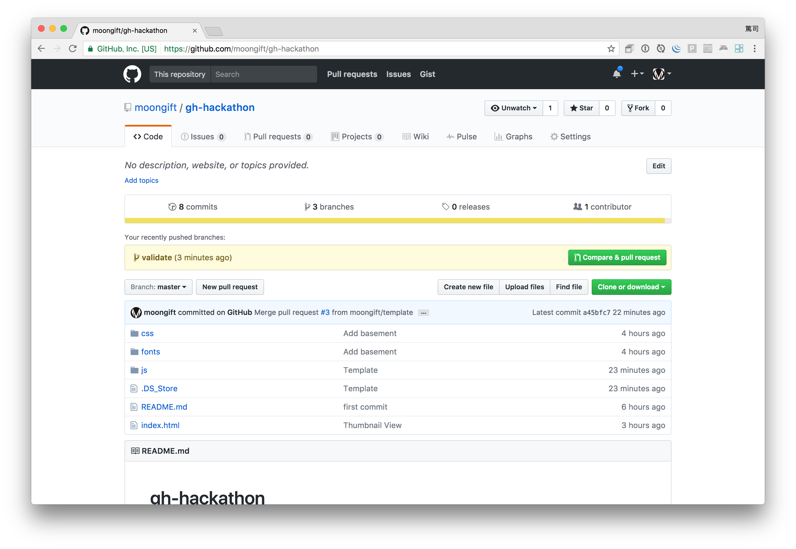

# 日報アプリを作る（その4）「入力チェックを行う」

前回に続いて日報アプリを作っていきます。今回は入力チェックを行う処理を作っていきたいと思います。

最近はサーバサイドでの入力チェックだけでなく、クライアントサイドでもチェックすることでエラー時のユーザストレスを軽減するようになっています。

## ブランチを作成する

今回も前回同様にブランチを作るところからはじめます。

```
$ git checkout -b validate
```

## index.jsの修正

今回修正対象となるのは次の処理です。

```
'input, textarea focusout': function(context, $el) {
},
```

指定したイベント（今回はフォーカスを外れたタイミング）でこの処理が呼び出されます。その際、2つの引数が渡されます。内容は次のようになります。

**contextの内容：**

```
EventContext {
	controller: Controller, 
	event: n.Event, 
	evArg: undefined, 
	selector: "input, textarea", 
	selectorType: 1
}
```

**$elの内容：**

```
[
	input#category.form-control, 
	context: input#category.form-control
]
```

必要に応じて使い分けてください。

## 処理の作成

では処理を書いていきます。まずコメントだけ書きます。

```
'input, textarea focusout': function(context, $el) {
	// 変数の定義

	// 除外条件の設定

	// 入力チェック
		// 入力されていない場合の処理
		// 入力されている場合の処理

	// メッセージの表示、非表示の指定
},
```

変数は次のようになります。

```
// 変数の定義
var value = $el.val();  // 入力された値
var name = $el.attr('name');  // 入力した場所の名前
var error_class  = 'has-error';  // エラー用クラス
var $msg = this.$find('.report-content').find('.msg');  // メッセージを出す場所
var $formGroup = $el.parents('.form-group');  // エラー用クラスを追加する場所
```

次に除外条件ですが、画像選択部分については無視するようにします。

```
// 除外条件の設定
if (name == 'img') {
	return;
}
```

入力チェックについてはまず次のようにします。

```
// 入力チェック
if (value == null || value == '') {
	// 入力されていない場合の処理
} else {
	// 入力されている場合の処理
}
```

hifiveには[入力値チェック（バリデーション） - hifive](http://www.htmlhifive.com/conts/web/view/reference/validator)機能もあるのですが、今回くらいの簡易的なチェックに使うにしては複雑になってしまうので簡易的なチェックとします。

まず入力されていない場合の処理を書きます。入力されていない場合は、入力項目名を取得して、メッセージを表示します。

```
// 入力されていない場合の処理
if ($formGroup.hasClass(error_class)) {
	// すでにエラー表示があるならば何もしない
	return;
}
// 空の入力項目に赤い枠を追加
$formGroup.addClass(error_class);

// 入力項目名（日本語）を取得
var label = $formGroup.find('label').text();

// メッセージの組み立て
var $p = $('<p data-handson-input-name="' + name + '">');
$p.append('<strong>' + label + 'を入力してください' + '</strong>');
// エラーメッセージの挿入
$msg.append($p);
```

続いて入力されている場合の処理です。こちらは、先にエラーメッセージやエラーのスタイルが適用されている場合に、それらを解除するための処理です。

```
// 入力されている場合の処理
// エラーの枠を外す
$formGroup.removeClass(error_class);

// 入力した項目のメッセージを消す
$msg.find('p[data-handson-input-name="' + name + '"]').remove();
```

最後にメッセージの表示、非表示を切り替える処理を書きます。

```
// メッセージの表示、非表示の指定
if ($msg.children().length != 0) {
	// エラーあり
	$msg.show();
} else {
	// エラーなし
	$msg.hide();
}
```

ここまでで処理が完成です。全体像は次のようになります。

```
'input, textarea focusout': function(context, $el) {
	// 変数の定義
	var value = $el.val();
	var name = $el.attr('name');
	var error_class  = 'has-error';
	var $msg = this.$find('.report-content').find('.msg');
	var $formGroup = $el.parents('.form-group');
	
	// 除外条件の設定
	if (name == 'img') {
		return;
	}
	
	// 入力チェック
	if (value == null || value == '') {
		// 入力されていない場合の処理
		if ($formGroup.hasClass(error_class)) {
			// すでにエラー表示があるならば何もしない
			return;
		}
		// 空の入力項目に赤い枠を追加
		$formGroup.addClass(error_class);
		
		// 入力項目名（日本語）を取得
		var label = $formGroup.find('label').text();
		
		// メッセージの組み立て
		var $p = $('<p data-handson-input-name="' + name + '">');
		$p.append('<strong>' + label + 'を入力してください' + '</strong>');
		
		// エラーメッセージの挿入
		$msg.append($p);
	} else {
		// 入力されている場合の処理
		// エラーの枠を外す
		$formGroup.removeClass(error_class);
		
		// 入力した項目のメッセージを消す
		$msg.find('p[data-handson-input-name="' + name + '"]').remove();
	}
	
	// メッセージの表示、非表示の指定
	if ($msg.children().length != 0) {
		// エラーあり
		$msg.show();
	} else {
		// エラーなし
		$msg.hide();
	}
},
```

ここまでできあがったら実際に動かしてみてください。何も入力せずにフォーカスを次の項目に移動したりすると、エラーメッセージが表示されるはずです。

## Gitにコミットする

作業が終わったらまずdiffオプションで内容を確認します。次のように出力されればOKです。

```
$ git diff
diff --git a/js/index.js b/js/index.js
index f00b921..b5a6048 100755
--- a/js/index.js
+++ b/js/index.js
@@ -12,8 +12,56 @@
                },
                
                'input, textarea focusout': function(context, $el) {
+                       // 変数の定義
+                       var value = $el.val();
```

問題なければコミットします。今回も新規ファイルはないので -a を使います。

```
$ git commit -a -m "Validate"
```

そしてGitHubへプッシュします。

```
$ git push origin validate
```

終わったらGitHubのリポジトリページへ行き、作成されているブランチからPull Requestを作成、masterブランチへマージします。



マージが終わったらローカルブランチをmasterに変更し、リモート上でのマージを反映します。

```
$ git checkout master
$ git pull
```

----

ここまででhifiveを使ったイベント処理の基本ができました。また、クライアントサイドでの入力チェック機能によって、ユーザビリティの高いフォームが作れたかと思います。

今回のコードは[hifive-github-handson/6 at master · hifivemania/hifive-github-handson](https://github.com/hifivemania/hifive-github-handson/tree/master/6)にて確認できます。また、[実際に動いているデモはこちらのURL](https://hifivemania.github.io/hifive-github-handson/6/)にて確認できます。

では次は[日報アプリを作る（その5）「画像のサムネイルを表示する」](7.md)で画像を選択した時にサムネイルを表示する処理を作ってみましょう。


